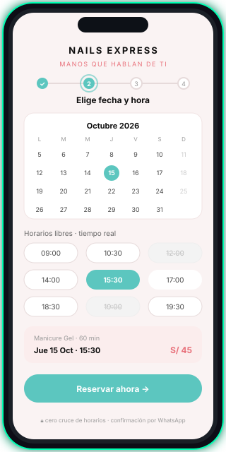
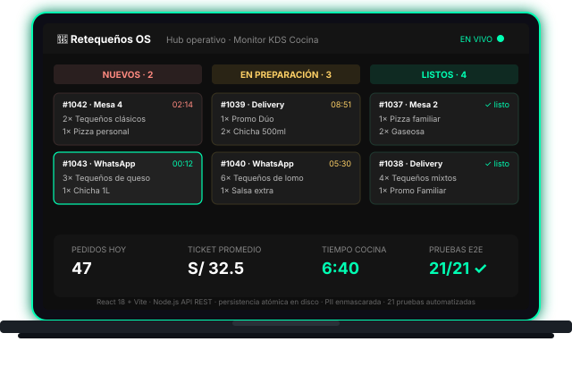

<div align="center">

<!-- ═══════════════════ HEADER ═══════════════════ -->



<br/>

<a href="#-stack"></a>
<a href="#-lo-que-construyo"></a>
<a href="#-stats"></a>
<a href="#-contacto"></a>

<br/><br/>

<a href="https://github.com/manuelandredp-gif?tab=followers"></a>
<a href="https://github.com/manuelandredp-gif?tab=repositories"></a>


</div>



<!-- ═══════════════════ TERMINAL ═══════════════════ -->
<div align="center">


<br/><br/>


</div>


<!-- ═══════════════════ ABOUT ═══════════════════ -->
<table border="0" width="100%">
<tr>
<td width="50%" valign="top">

### 🐍 `about.py`

```python
from datetime import date

class ManuelDongo:
    """Estudiante de Ing. de Sistemas que ya está
    construyendo software para empresas reales."""

    nombre   = "Manuel Andree Dongo Palza"
    ciudad   = "Tacna, Perú"
    carrera  = "Ingeniería de Sistemas"
    estado   = "últimos ciclos"

    def construyendo(self) -> list[str]:
        return [
            "aplicativos web para negocios",
            "landing pages que convierten",
            "paneles de administración",
            "automatizaciones en Python",
        ]

    def stack(self) -> dict:
        return {
            "core":     ["Python", "JavaScript", "SQL"],
            "frontend": ["HTML", "CSS", "React"],
            "backend":  ["Flask", "Node.js"],
            "ops":      ["Linux", "Bash", "Git", "Docker"],
        }

    def aprendiendo(self) -> list[str]:
        return ["Linux a fondo", "DevOps", "Python avanzado"]

    def __repr__(self):
        return f"<Dev {self.nombre} · {date.today().year}>"


if __name__ == "__main__":
    yo = ManuelDongo()
    print(yo)
    for cosa in yo.construyendo():
        print(f"  ├─ {cosa}")
    print("  └─ y lo que venga.")
```

</td>
<td width="50%" valign="top">

### 🐧 `about.sh`

```bash
#!/usr/bin/env bash
# ───────────────────────────
#  Manuel Dongo · modo terminal
# ───────────────────────────

ROL="Estudiante de Ing. de Sistemas"
CICLO="últimos ciclos"
CIUDAD="Tacna, Perú"

construyo=(
  "apps web"
  "landing pages"
  "paneles admin"
  "scripts en Python"
)

echo "👋  Hola, soy Manuel"
echo "📍  $CIUDAD · $ROL ($CICLO)"
echo
echo "🚀  Actualmente construyo:"
for item in "${construyo[@]}"; do
  echo "    ▸ $item"
done
echo
echo "🐍  Lenguaje favorito : Python"
echo "🐧  Sistema del día   : Linux"
echo "☕  Combustible       : café"
echo
echo "💡  Filosofía:"
echo "    'Si lo haces dos veces, escribe un script.'"

exit 0
```

<br/>

<div align="center">


</div>

</td>
</tr>
</table>


<!-- ═══════════════════ STACK ═══════════════════ -->
<div align="center">

## 🛠️ Stack


<br/><br/>

<table border="0">
<tr>
<td align="center" width="25%">

**Lenguajes**

<br/>
<br/>
<br/>


</td>
<td align="center" width="25%">

**Frontend**

<br/>
<br/>
<br/>


</td>
<td align="center" width="25%">

**Backend**

<br/>
<br/>
<br/>


</td>
<td align="center" width="25%">

**Ops & Tools**

<br/>
<br/>
<br/>


</td>
</tr>
</table>

<br/>



</div>


<!-- ═══════════════════ PROYECTOS ═══════════════════ -->
<div align="center">

## 🚀 Lo que construyo

Sistemas reales, para negocios reales de Tacna. No son ejercicios: tienen usuarios, pedidos y citas de verdad.

<br/>

<table border="0">
<tr>
<td align="center" valign="middle" width="34%">



<sub><b>Nails Express</b> · flujo de reserva en tiempo real</sub>

</td>
<td align="center" valign="middle" width="66%">



<sub><b>Retequeños OS</b> · monitor KDS de cocina + hub administrativo</sub>

</td>
</tr>
</table>

<br/>

<table border="0" width="100%">
<tr>
<td width="33%" valign="top">

<a href="https://github.com/manuelandredp-gif/Nails-Express"></a>


**Web de reservas + panel admin** para un estudio de uñas.

- Motor de citas con **cero cruce de horarios** (transacciones + restricción `btree_gist` en BD)
- Horarios libres en tiempo real, confirmación `.ics` / Google Calendar
- Calendario admin drag-and-drop, SEO con JSON-LD y sitemap

<a href="https://nails-express.vercel.app"></a>

</td>
<td width="33%" valign="top">

<a href="https://github.com/manuelandredp-gif/RETEQUE-OS"></a>


**Ecosistema digital** para una tequeñería: web de pedidos por WhatsApp, app móvil y hub operativo.

- Monitor **KDS de cocina** en tiempo real con API REST propia
- Persistencia atómica en disco, precios calculados en servidor
- Auditoría de seguridad: PII enmascarada, anti-XSS, **21 pruebas E2E**

<a href="https://github.com/manuelandredp-gif/RETEQUE-OS"></a>

</td>
<td width="33%" valign="top">

<a href="https://github.com/manuelandredp-gif/ASAS"></a>


**ImportEase** — plataforma de gestión comercial con backend Spring Boot y cliente de escritorio admin.

- API REST con JPA + validación, contraseñas con BCrypt
- Reportes en **PDF y Excel** (OpenPDF, Apache POI), correo transaccional
- Dockerizado y desplegable en Railway

<a href="https://github.com/manuelandredp-gif/ASAS"></a>

</td>
</tr>
</table>

<br/>

```yaml
principios:
  - "Código limpio antes que código rápido"
  - "Si no se puede medir, no está terminado"
  - "Documentar es parte de programar"
  - "Seguridad desde el primer commit, no al final"
```

</div>


<!-- ═══════════════════ CERTIFICACIONES ═══════════════════ -->
<div align="center">

## 🎓 Certificaciones


<br/><br/>

<a href="./certificados/anthropic-education-cert-01.pdf"></a>
<a href="./certificados/anthropic-education-cert-02.pdf"></a>
<a href="./certificados/anthropic-education-cert-03.pdf"></a>
<a href="./certificados/anthropic-education-cert-04.pdf"></a>
<a href="./certificados/anthropic-education-cert-05.pdf"></a>
<a href="./certificados/anthropic-education-cert-06.pdf"></a>
<a href="./certificados/anthropic-education-cert-07.pdf"></a>

<sub>Haz clic en cualquiera para abrir el PDF original.</sub>

</div>


<!-- ═══════════════════ STATS ═══════════════════ -->
<div align="center">

## 📊 Stats


<br/><br/>


<br/><br/>


<br/><br/>


</div>


<!-- ═══════════════════ CONTRIBUCIONES ═══════════════════ -->
<div align="center">

## 🟩 Mapa de contribuciones



</div>

<!--
  NOTA: cuando habilites GitHub Actions (pestaña Actions -> Enable -> Run workflow),
  se generan el snake y el grafico 3D. Para mostrarlos, descomenta estas lineas:

  
  
-->


<!-- ═══════════════════ CONTACTO ═══════════════════ -->
<div align="center">

## 🌐 ¿Tienes una idea? Hablemos.

Respondo rápido. Si tienes un negocio y necesitas una web, un sistema de reservas o pedidos, o automatizar algo que hoy haces a mano, escríbeme.

```javascript
const contacto = {
  whatsapp : "+51 906 648 502",
  email    : "manuelandredp@gmail.com",
  linkedin : "linkedin.com/in/manuel-andree-dongo-palza-1b3234330",
  github   : "github.com/manuelandredp-gif",
  ubicacion: "Tacna, Perú 🇵🇪",
  abiertoA : ["proyectos freelance", "prácticas / trainee", "colaboraciones"],
};
```

<a href="https://wa.me/51906648502?text=Hola%20Manuel%2C%20vi%20tu%20perfil%20en%20GitHub%20y%20quiero%20conversar%20sobre%20un%20proyecto"></a>

<br/><br/>

<a href="https://www.linkedin.com/in/manuel-andree-dongo-palza-1b3234330"></a>
<a href="https://github.com/manuelandredp-gif"></a>
<a href="mailto:manuelandredp@gmail.com?subject=Proyecto%20desde%20GitHub"></a>
<a href="https://wa.me/51906648502"></a>

<br/><br/>


</div>
